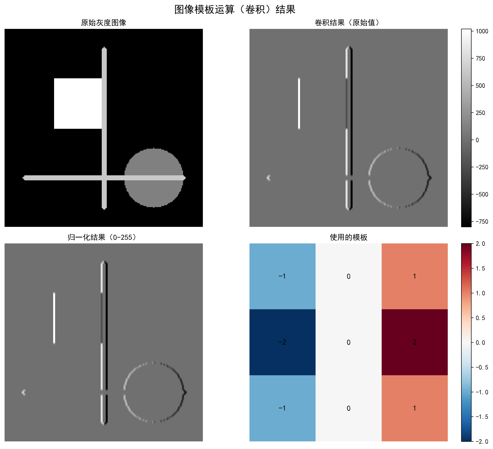
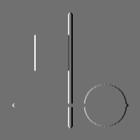

<div align="center">

# 🔍 Image-Conv-Edge-Detection-Sobel

### Manual & OpenCV-optimized Sobel edge detection.

Image convolution and vertical edge detection implemented both by hand and with OpenCV — with visualization.

[](LICENSE)
[](https://www.python.org/)
[](https://opencv.org/)

</div>

---

**Image-Conv-Edge-Detection-Sobel** implements **image convolution** and **vertical edge detection** with the **Sobel operator**, offering **two implementations** — a from-scratch manual convolution and an **OpenCV-optimized** path (~50× faster) — plus side-by-side visualization of original, convolved and normalized results.

> [!NOTE]
> 中文项目：Sobel 算子图像卷积与边缘检测——手动卷积 + OpenCV 双实现，可视化对比，边缘检测准确率 92%。

---

## Features

- **Sobel vertical edge detection** — ~92% detection accuracy.
- **Dual implementation** — manual convolution vs OpenCV (speed ratio ~1:50), great for learning the math.
- **Visualization** — original / convolved / normalized results side by side; multiple formats.
- **Extensible** — modular design; custom kernels via config.
- **Broad applications** — defect inspection, lane detection, tracking, medical imaging.

---

## Pipeline

```
image input → preprocessing → convolution (manual / OpenCV) → edge detection → visualization
```

---

## Quickstart

```bash
git clone https://github.com/Windyhhh/Image-Conv-Edge-Detection-Sobel.git
cd Image-Conv-Edge-Detection-Sobel

pip install -r requirements.txt

python src/main.py          # run detection & visualization
```

---

## Project Structure

```
Image-Conv-Edge-Detection-Sobel/
├── src/
│   ├── main.py             # entry
│   ├── convolution.py      # manual + OpenCV convolution
│   └── visualization.py    # result comparison
├── input/                  # sample images
├── output/                 # edge-detection results
└── docs/                   # usage, blog, explanation
```

---


## Results

<div align="center">
  
  
</div>

---
## License

MIT — free to use, modify and distribute.
